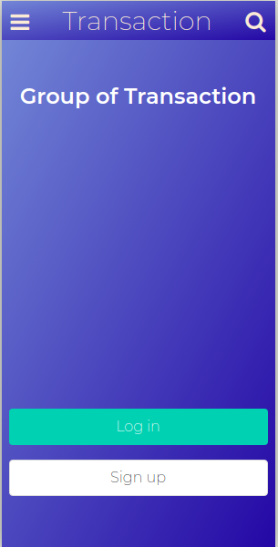
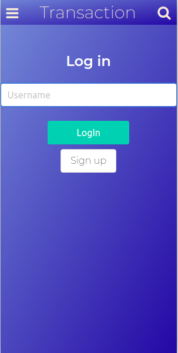
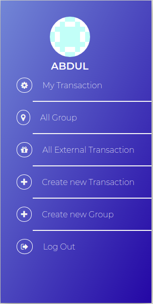
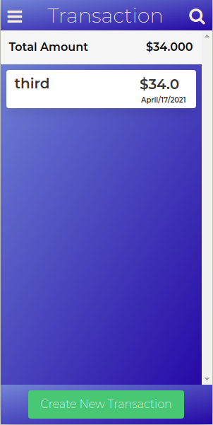
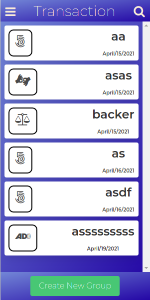
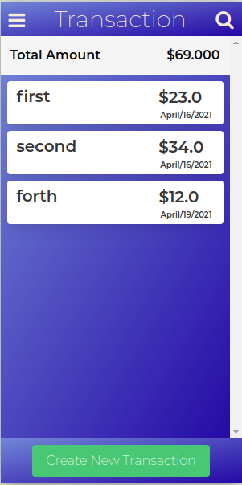
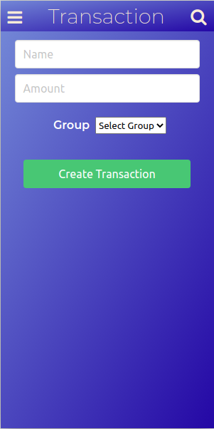
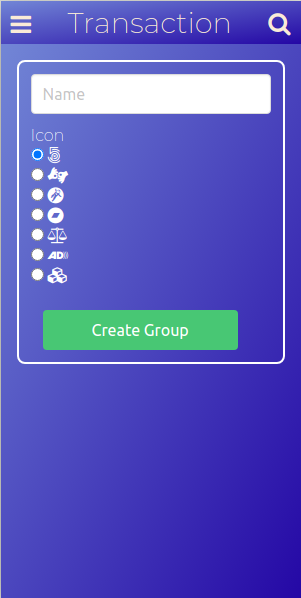

# Open for Friends

> Social media app Build with ruby on rails. In this app users are able to create new Group where he will be able to do transaction some donation.

## Screen Shot











## Live Demo

[Demo](https://mysterious-tundra-66669.herokuapp.com/)

## Built With

- Ruby v3.0.0
- Ruby on Rails v6.1.3
- Rspec Rails v5.0
- Bulma Rails v0.9.1
- Capybara v3.26
- shoulda-matchers v4.0
- font-awesome scss v5.15.1
- simple-form v5.1
- better_errors v2.9.1
- Rubocop v1.11
- Postgres

## Getting Started

To get a local copy up and running follow these simple example steps.

### Prerequisites

- Ruby: v3.0.0
- Rails: v6.1.3
- Postgres: v13.2
- Node v10.19.0 - v14.15.5
- Bundle v2.2.3

### Set up

To get a local copy of this repository enter the following command in you terminal:

```
    git clone https://github.com/abdulkhaliqdev/Group-our-transactions.git
```

Or download this repository and unzip it.

### Installation

- From the project's root directory execute 'bundle install' to install the necessary gems:

```
    bundle install
```

- Then run yarn to install all the node dependancies:

```
    yarn
```

- Make a migration of the database:

```
    rails db:create
    rails db:migrate
```

### Usage

- In the project's root directory execute the 'rails server' command:

```
    rails s
```

- Open in your browser


Open `http://localhost:3000/` in your browser.

### Run tests

```
    rpsec --format documentation
```

### Deployment

TBA

## Authors

👨‍💻 **Abdul Khaliq**

- Github: [@abdulkhaliqdev](https://github.com/abdulkhaliqdev)
- Twitter: [@abdulkhaliqdev](https://twitter.com/Abdulkhaliqdev)
- LinkedIn: [LinkedIn](https://www.linkedin.com/in/abdul-khaliq-89452b1a9/)

## 🤝 Contributing

Contributions, issues and feature requests are welcome!

Feel free to check the [issues page](https://github.com/abdulkhaliqdev/Group-our-transactions/issues).

## Show your support

Give a ⭐️ if you like this project!

## Acknowledgments

- Microverse
